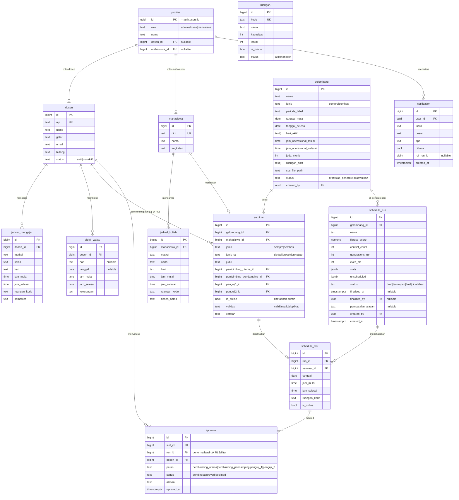

# Database ERD — SIPENTA

Postgres (Supabase). Nama tabel & kolom pakai bahasa Indonesia domain. Sumber kebenaran skema: `supabase/migrations/`.

## Diagram relasi

## Catatan desain

- **`profiles`** memetakan `auth.users` → role + tautan ke `dosen`/`mahasiswa`. Helper SQL `auth.role()`, `auth.dosen_id()`, `auth.mahasiswa_id()` dipakai di kebijakan RLS.
- **`seminar`** punya **4 FK ke `dosen`** (pembimbing utama, pembimbing pendamping, penguji 1, penguji 2). Data mahasiswa + kedua pembimbing berasal dari **sheet pendaftaran** (dibaca `parse-sps`, `mahasiswa` dibuat otomatis). Penguji 1 & 2 diisi **manual oleh admin** di langkah preview → nullable saat impor, wajib sebelum `generate`. `is_online` juga ditetapkan admin di langkah preview.
- **`schedule_run`** = satu kali eksekusi GA untuk sebuah gelombang. Satu gelombang boleh punya banyak run (generate ulang); hanya satu yang akhirnya `final`. `final` hanya bisa dicapai lewat RPC `finalisasi_jadwal` **setelah setiap slot di-ACC 4 dari 4 dosen** (2 pembimbing + 2 penguji); run lain di gelombang itu otomatis jadi `dibatalkan`.
- **`approval`** menyimpan `run_id` (denormalisasi) supaya RLS & realtime bisa filter tanpa join berantai.
- **Waktu** disimpan `time` + `hari` (text: `senin`..`jumat`) untuk data berulang (jadwal mengajar/kuliah/blokir), dan `date` + `time` untuk slot seminar konkret.
- **`ruangan.is_online`** — slot di ruangan online tak dibatasi kapasitas paralel; GA melewati H1.
- **Cascade**: hapus `schedule_run` → hapus `schedule_slot` → hapus `approval`. Hapus `gelombang` → hapus `seminar` + semua run.
- **Index penting**: `seminar(gelombang_id)`, `schedule_slot(run_id)`, `approval(dosen_id, status)`, `approval(run_id)`, `notification(user_id, dibaca)`, `jadwal_mengajar(dosen_id)`.

## Storage buckets

| Bucket | Isi | Akses |
|---|---|---|
| `sps` | file Excel pendaftaran per gelombang | `admin` upload/read; privat |
| `exports` | hasil Excel/PDF | dibuat Edge Fn; signed URL berlaku 1 jam |
| `templates` | template Excel SPS resmi | publik read |
